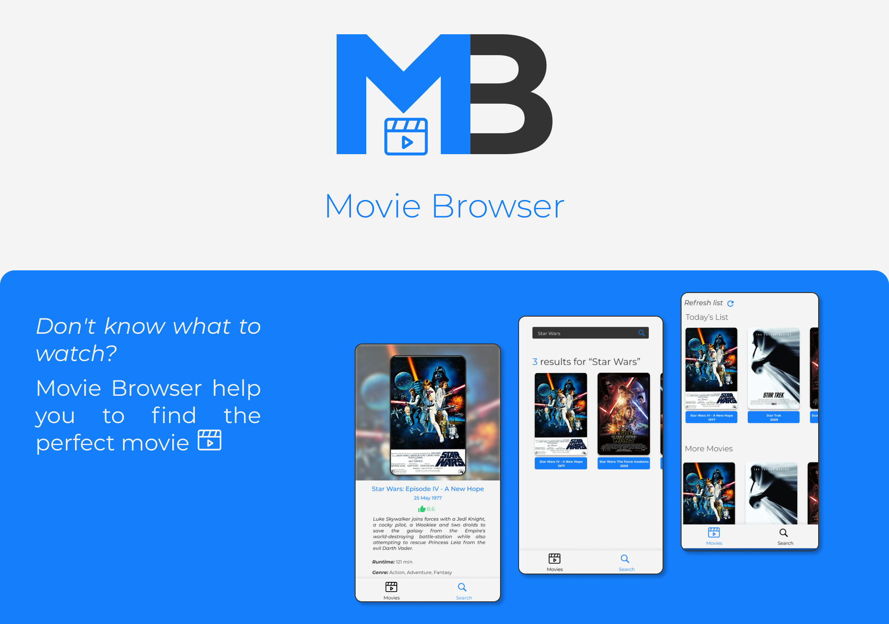

# Movie Browser :movie_camera:

> #### :mag: Don't know what to watch? Movie Browser help you to find the perfect movie.

> This project was build during the **CS50's Mobile App Development with React Native** course promoted by [Harvard University](https://www.edx.org/course/cs50s-mobile-app-development-with-react-native)

# :pushpin: Table of Contents

- [Features](#bulb-features)
- [Requirements](#construction-requirements)
- [Installation](#white_check_mark-installation)
- [Quick Start](#rocket-quick-start)
- [Technologies](#fire-technologies)
- [Contributing](#robot-contributing)
- [License](#pencil-license)

# :bulb: Features

- [x] :file_folder: Custom Movie Feed.
- [x] :repeat: Refresh Movie Lists.
- [x] :mag: Search Movies.
- [x] :memo: Check Movie Info.

# :construction: Requirements

- [x] Git
- [x] Node.js
- [x] Expo CLI

# :white_check_mark: Installation

**First check if you have all the requirements above, then clone this repository:**

- Using HTTP protocol:

  - `git clone https://github.com/Yuziem14/movie-browser.git`

- Using SSH protocol:
  - `git clone git@github.com:Yuziem14/movie-browser.git`

_Obs: Only clone with SSH if you already have a safe SSH key configured._

# :rocket: Quick Start
Enter in the project root directory, then:
1. Run `cp .env.example .env` to copy the environment variables file and set your [OMDB API Key](http://www.omdbapi.com/) in the .env file
2. Run `npm install` to install all dependencies.
3. Run `expo start` to start the app.

_Obs: If you want, use yarn instead of npm._

# :fire: Technologies

This project was build with:

- [Node.js](https://nodejs.org/en/)
- [React Native](https://reactnative.dev/) + [Expo](https://expo.io/)

# :robot: Contributing

This project is under the MIT license, so feel free to contribute with it.

# :pencil: License

Read the [License](LICENSE.md) for this project.

---

> _Made with :heart: by Yuri Ziemba._